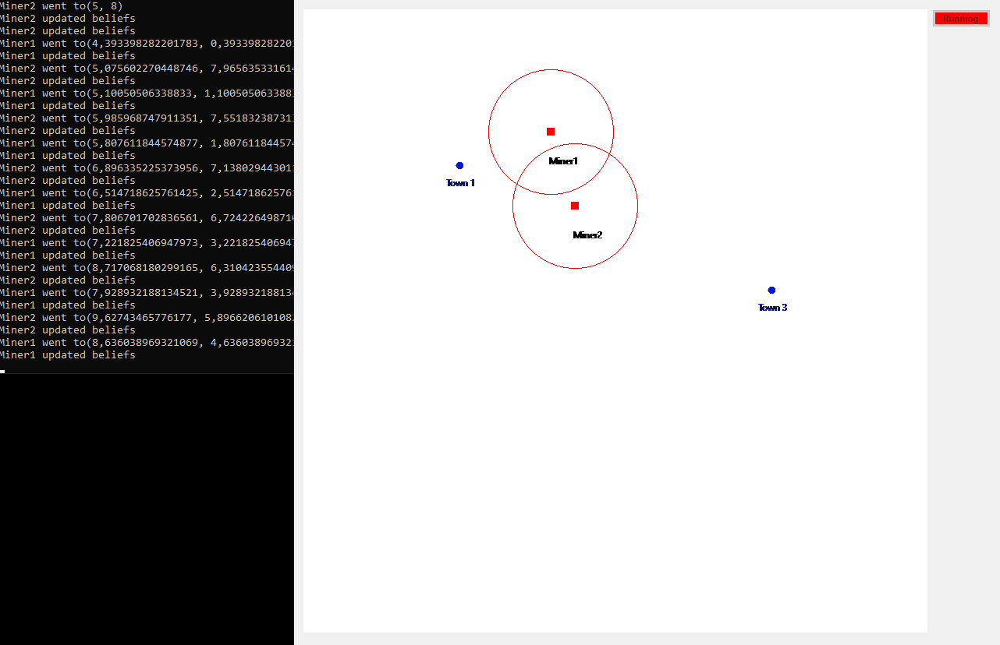
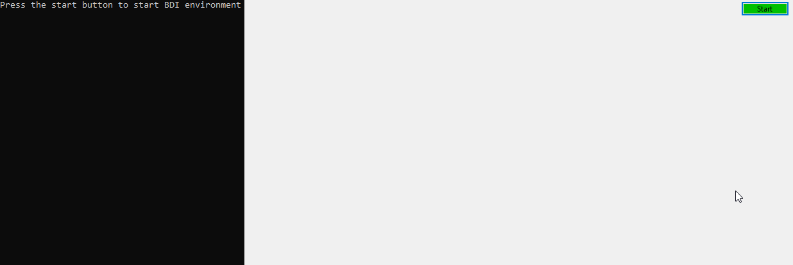
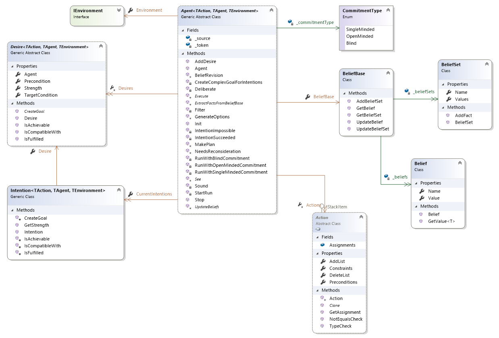
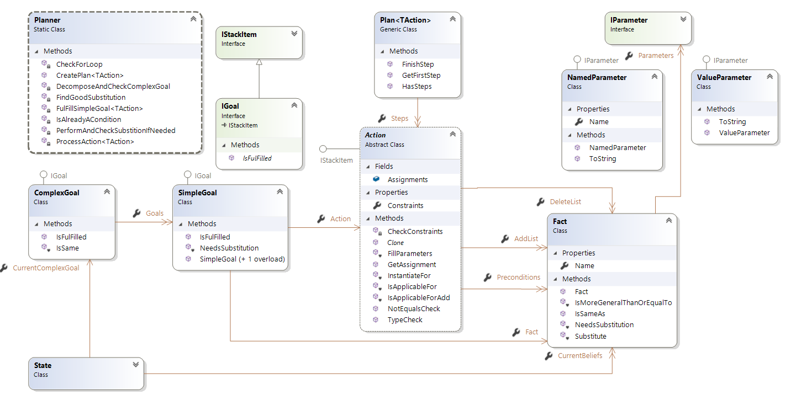

# DotNetBDI
BDI framework for .NET Core

For more information on BDI, we refer to [wikipedia](https://en.wikipedia.org/wiki/Belief%E2%80%93desire%E2%80%93intention_software_model)

By using this library, you can create your own complete environment for simulating the behaviour of BDI agents.

Some visual examples
--------------------




Sample
======

First of we must define our environment in which the agent or agents will operate. This class must inherit from the Environment class from the NetBDI.Core library.
The environment generally contains elements which the agent can interact with.
For our example, we chose a map of 20 by 20 containing towns and gold mines and on initializing the environment, we already fill it with some towns and gold mines.

Environment
-----------
```csharp
public class GoldMineEnvironment : NetBDI.Core.Environment
{
    public List<Town> Towns { get; set; } = new List<Town>();
    public List<GoldMine> GoldMines { get; set; } = new List<GoldMine>();
    public GoldMineEnvironment()
    {
        Towns.Add(new Town(5, 5));
        Towns.Add(new Town(7, 19));
        Towns.Add(new Town(15, 9));
        GoldMines.Add(new GoldMine(1, 1));
        GoldMines.Add(new GoldMine(10, 8));
        GoldMines.Add(new GoldMine(19, 18));
        GoldMines.Add(new GoldMine(12, 15));
    }
}
```
Actions
-------
Next, we define some actions possible in this environment by the agent. 
First of all, we create an abstract class that inherits from the STRIPS.Action as an action is used in planning AND in execution.
```csharp
using System.Threading.Tasks;

public abstract class GoldMineAction : STRIPS.Action
{
    public abstract Task Execute(GoldMineAgent agent);
}
```

A simple action we can define is the action to sell gold. This action inherits from the previously defined GoldMineAction.
 ```csharp
 public class SellGoldAction : GoldMineAction
 {
    public SellGoldAction()
    {
        var x = new NamedParameter("param1");
        var y = new NamedParameter("param2");
```
Preconditions are facts that the agent must believe in before the action can be performed. Note that any fact can hold either value parameters (holding a fixed value) or named parameters which can be filled in during the planning. On execution, we can be sure that all named parameters have been replaced by values.
```csharp
        Preconditions.Add(new Fact(Definitions.HasGold, new ValueParameter(true)));
        Preconditions.Add(new Fact(Definitions.Town, x, y));
        Preconditions.Add(new Fact(Definitions.In, x, y));
```
In the AddList, we add facts that will be true and added to the beliefbase of the agent once the action has been executed. This is usefull when planning in order to reach a goal.
```csharp
        AddList.Add(new Fact(Definitions.HasGold, new ValueParameter(false)));
```
In the DeleteList, we add facts that will be removed from the beliefbase of the agent once the action has been executed 
```csharp
        DeleteList.Add(new Fact(Definitions.HasGold, new ValueParameter(true)));
    }
    ...
}
```
Agent
-----
We can now create our agent class as an implementation of the Agent class of our library. Our agent can also keep an internal state like its current position and whether or not the agent is carrying gold. Upon creation, we have to provide an environment in which the agent will operate as well as a commitmenttype (initialized as BlindCommitment when not provided). More in commitment types later. We also define in our constructor what the capabilities (the type of actions the agent can perform) are for this agent.
 ```csharp
 public class GoldMineAgent : NetBDI.Core.Agent<GoldMineAction, GoldMineAgent, GoldMineEnvironment>
    {
        public bool HasGold { get; set; }
        public double CurrentX { get; set; }
        public double CurrentY { get; set; }

        public GoldMineAgent(GoldMineEnvironment environment, int currentX, int currentY, NetBDI.Core.CommitmentType? comType = null) : 
            base(environment, comType)
        {
            CurrentX = currentX;
            CurrentY = currentY;
            Actions.Add(new GoToAction());
            Actions.Add(new MineGoldAction());
            Actions.Add(new SellGoldAction());
        }
```
Once our environment and agent have been created, we can start our agent so it can operate in the environment.
An agent keeps track of its beliefs about the environment in a beliefbase. A beliefbase consists of beliefsets (a collection of facts) and separate beliefs. In this example we simply allow the agent to keep track of where towns are and where gold mines are.
During activation of our agent, we must provide a list of the current desires for this agent and if present, a current intention of the agent.
```csharp
        public override Task Init(List<NetBDI.Core.Desire<GoldMineAction, GoldMineAgent, GoldMineEnvironment>> desires,
            NetBDI.Core.Intention<GoldMineAction, GoldMineAgent, GoldMineEnvironment> intention = null)
        {
            BeliefBase.AddBeliefSet(new BeliefSet("mines"));
            BeliefBase.AddBeliefSet(new BeliefSet("towns"));
            return base.Init(desires, intention);
        }
```
To execute an action, the agent must implement a way to execute its specific actions.
```csharp
        protected override Task Execute(GoldMineAction action) => action.Execute(this);
```
In order to work with STRIPS, we need to extract predicates or facts from the beliefbase. This is done in a separate method which simply returns a list of facts based on the beliefs of the agent.
```csharp
        protected override List<NetBDI.STRIPS.Fact> ExtractFactsFromBeliefBase()
        {
            var lstFact = new List<NetBDI.STRIPS.Fact>();
            lstFact.Add(new NetBDI.STRIPS.Fact(Definitions.HasGold, new ValueParameter((bool)BeliefBase.GetBelief("hasgold").Value)));

            lstFact.Add(new NetBDI.STRIPS.Fact(Definitions.In, new ValueParameter(BeliefBase.GetBelief("inx").Value), 
                new ValueParameter(BeliefBase.GetBelief("iny").Value)));

            ...
            
            foreach (GoldMine mine in BeliefBase.GetBeliefSet("mines").Values)
                lstFact.Add(new NetBDI.STRIPS.Fact(Definitions.Mine, new ValueParameter(mine.X), new ValueParameter(mine.Y)));

            return lstFact;
        }
```
To simulate our system well, we separate the environment from the agent such that the agent can only perceive a portion of the environment or with other restrictions as in the real world. This is simulated in the See method. In this example, we let the agent see in a radius of 2 around himself to observe possible towns and goldmines. The percepts are simply stored in a list of keyvalue pairs.
```csharp
        protected override Dictionary<string, object> See()
        {
            var dict = new Dictionary<string, object>();
            var lstTowns = new List<Town>();
            dict.Add("towns", lstTowns);
            foreach(var town in Environment.Towns)
                if (Math.Pow(CurrentX - town.X, 2) + Math.Pow(CurrentY - town.Y, 2) < 4)
                    lstTowns.Add(town);

            var lstMines = new List<GoldMine>();
            dict.Add("mines", lstMines);
            foreach (var mine in Environment.GoldMines)
                if (Math.Pow(CurrentX - mine.X, 2) + Math.Pow(CurrentY - mine.Y, 2) < 4)
                    lstMines.Add(mine);

            return dict;
        }
```
In a separate step after the agent has perceived the environment, it will update its beliefbase based on these percepts. This is done in the updatebeliefs method. In this method, we receive the percepts of the See method and update the beliefsets and beliefs of our beliefbase.
```csharp
        protected override void UpdateBeliefs(Dictionary<string, object> percepts)
        {
            var beliefSetTowns = BeliefBase.GetBeliefSet("towns").Values;
            var beliefSetMines = BeliefBase.GetBeliefSet("mines").Values;
            
            foreach(var town in (percepts["towns"] as List<Town>))
                if (!beliefSetTowns.Contains(town))
                    beliefSetTowns.Add(town);

            ...
            
            BeliefBase.UpdateBelief(new Belief("hasgold", HasGold));
        }
    }
}
```

We haven't spoken about the commitment types of our agent yet. There are three commitment types : blind commitment, single-minded commitment and open-minded commitment. Each has its own uses and is for instance explained in the book "The Design of Intelligent Agents: A Layered Approach" by Jorg P. Muller, Jörg P. Müller or "An Introduction to MultiAgent Systems" by Michael Wooldridge which are both very interesting reads.

Desire
------
We haven't given our agent a desire yet. Without desires and corresponding intentions, the agent will not perform any action. It can perhaps perceive its environment but lacks a desire to act upon the beliefs it has of said environment. In this example, we will discuss the possible desire of an agent to sell gold. Each desire has a certain strength expressed in an integer. THe higher the strength of the desire, the more likely the agent will transform the desire into an intention. An intention is planned for and if a plan exists, it will be executed, thus fulfilling the intention and underlying desire. A desire can have a precondition so that it can only be active when certain preconditions are satisfied. In this example does the agent only exhibit a desire to sell gold once it is carrying gold (obtained through whatever method).
```csharp
public class SellGoldDesire : NetBDI.Core.Desire<GoldMineAction, GoldMineAgent, GoldMineEnvironment>
{
    public SellGoldDesire() : base(2) //strength of 2
    {
        Precondition = HasGold;
    }
    
    private bool HasGold() => (bool)Agent.BeliefBase.GetBelief("hasgold").Value;
```  
To make things easy for the STRIPS planner, we let the desire create its own goal as a combination of facts the planner needs to achieve by choosing the correct sequence of actions (a plan). In this case, our goal is to get rid of the gold (in our environment only possible if the agent sells the gold).
```csharp
    public override ComplexGoal CreateGoal()
    {
        var complexGoal = new ComplexGoal();
        complexGoal.Goals.Add(new SimpleGoal(new Fact(Definitions.HasGold, new ValueParameter(false))));
        return complexGoal;
    }
}
```

Combining everything
--------------------
To run our example, we simply need to instantiate an environment, place an agent in that environment and let the agent start running by giving it its initial desires. The agent will run indefinitely even when all desires are fulfilled as new desires can be added at runtime by the user when needed.
```csharp
var environment = new GoldMineEnvironment();
var agent = new GoldMineAgent(environment, 5, 5, CommitmentType.Blind);
agent.Init(new List<Desire<GoldMineAction, GoldMineAgent, GoldMineEnvironment>> { new ExploreDesire(), new SellGoldDesire(), new MineGoldDesire() }, null);
```

Technical Details
=================

Class Diagram for NetBDI.Core


Class Diagram for NetBDI.STRIPS


Sequence Diagram for Blind Commitment


Sequence Diagram for Single Minded Commitment


Sequence Diagram for Open Minded Commitment